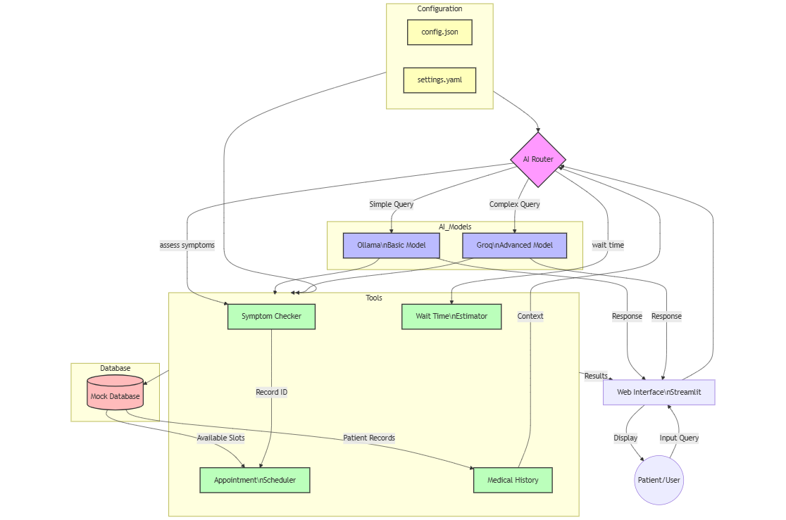

# Let's Build AI Router for Healthcare Triage System

Practical AI Implementation in Healthcare - From Concept to Code

TL;DR

A hands-on guide showing how to build an AI-powered warehouse management system using Python and modern AI technologies. The system helps businesses analyze inventory data, predict stock needs, and make smarter warehouse decisions through natural language interactions.

Full Article : [https://medium.com/@learn-simplified/practical-guide-my-building-of-ai-warehouse-manager-35a278e0762d


Tech stack
# Let's Build AI Router for Healthcare Triage System

## Frontend Technologies
| Category | Technology | Version | Purpose |
|----------|------------|----------|----------|
| **Core Framework** | Python | 3.x | Base programming language |
| **Web Interface** | Streamlit | >= 1.31.0 | Interactive web UI for healthcare triage |
| **AI Models** | Langchain-core | >= 0.1.27 | Base AI orchestration |
| | Langchain-groq | >= 0.0.8 | Advanced medical query handling |
| | Langchain-community | >= 0.0.24 | Community LLM integrations |
| | Ollama | llama3.2:3b | Basic query processing |
| | Groq | mixtral-8x7b-32768 | Complex medical query processing |
| **Data Handling** | PyYAML | Built-in | Configuration management |
| | JSON | Built-in | Data structuring & API responses |
| | Python-dotenv | >= 1.0.1 | Environment variable management |
| **Type System** | Pydantic | >= 2.6.1 | Data validation |
| | Typing-extensions | >= 4.9.0 | Enhanced type hints |
| **Time Management** | Pytz | >= 2024.1 | Timezone handling |
| **Development Tools** | Mock Database | Custom | Simulated healthcare data storage |
| **Configuration** | YAML | N/A | Complex system settings |
| | JSON | N/A | API configurations |


## Introduction
In today’s fast-paced business environment, the difference between success and failure often comes down to how quickly and accurately you can make decisions. While artificial intelligence might sound futuristic, this article demonstrates a practical, implementable way to bring AI into everyday warehouse operations. Through our example warehouse system, you’ll see how AI can:

 - Transform complex data analysis into simple conversations
- Help predict inventory needs before shortages occur
- Reduce the time spent training new staff on complex systems
- Enable faster, more accurate decision-making

Even though our example uses a fictional warehouse, the principles and implementation details apply to real-world businesses of any size looking to modernize their operations.

## Architecture

### Let's Build AI Router for Healthcare Triage System





# Tutorial: Let's Build AI Router for Healthcare Triage System

## Prerequisites
- Python installed on your system.
- A basic understanding of virtual environments and command-line tools.

## Steps

1. **Virtual Environment Setup:**
   - Create a dedicated virtual environment for our project:
   
     ```bash
     python -m venv My-Building-of-AI-warehouse-manager
     ```
   - Activate the environment:
   
     - Windows:
       ```bash
       My-Building-of-AI-warehouse-manager\Scripts\activate       
       ```
     - Unix/macOS:
       ```bash
       source My-Building-of-AI-warehouse-manager/bin/activate
       ```
   

# Installation and Setup Guide

**Install Project Dependencies:**

Follow these steps to set up and run the  "Let's Build AI Router for Healthcare Triage System"

1. Navigate to your project directory:
   ```
   cd path/to/your/project
   ```
   This ensures you're in the correct location for the subsequent steps.

2. Install the required dependencies:
   ```
   pip install -r requirements.txt   
   ```
   This command installs all the necessary Python packages listed in the requirements.txt file.


## Run - Hands-On Guide: Let's Build AI Router for Healthcare Triage System

   ```bash 
     
      # Run 
      streamlit run app.py
      
   ```
